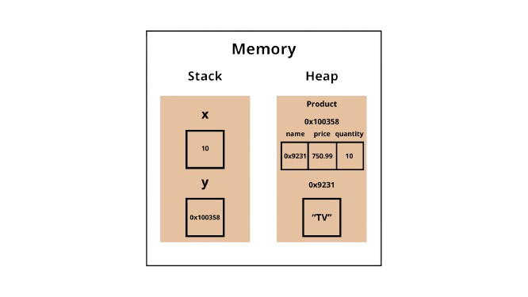
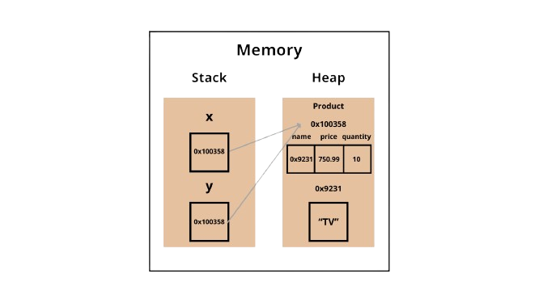
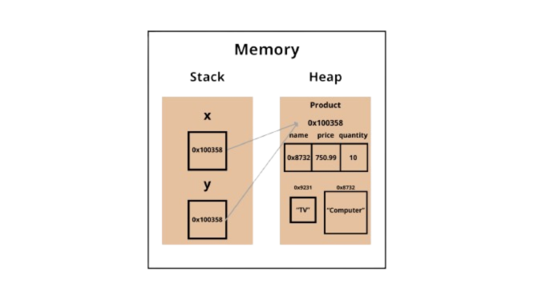
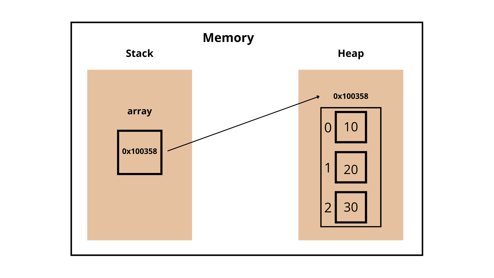
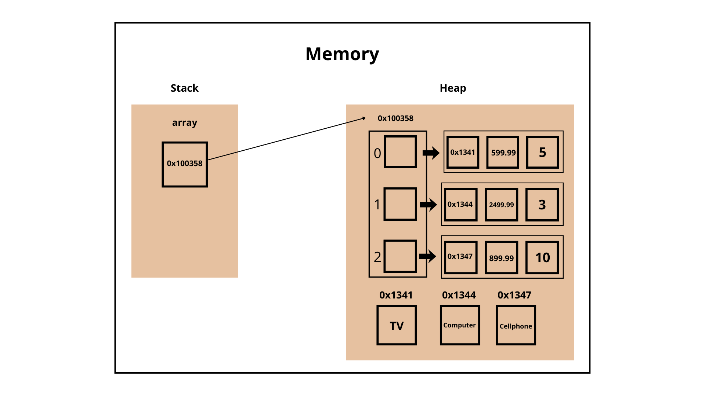

# 1- Memory Model
## In the memory we have two parts: *Stack* and *Heap*

### Stack
#### Stack is a memory area to store variables.
#### If the variable is a primitive type, it stores the variable with its data. If it's not, when it is an object (an instance of a class) it is only a reference. Note java does not have pointers, so we call it reference.
### Note: In java String is an object.

### Heap
#### Heap is a memory area to store data of objects.
#### For variables that are not primitive types (objects), they exist in the stack but the value of that variable is just a reference.
### The reference tells where the data is in the heap. In other words, the data is on the heap, and the variable in the stack refers to that data.

```
public class Main {
    public static void main(String[] args) {

        int x = 10;
        Product y = new Product("Tv", 750.99, 10);
    }
}
```

```
public class Product {

    String name;
    double price;
    int quantity;

    public Product(String name, double price, int quantity) {
        this.name = name;
        this.price = price;
        this.quantity = quantity;
    }
}

```



# 2- Aliasing
## A curious fact and source of many bugs for inattentive developers is aliasing, a situation that occurs when two variables refer to the same object in the heap.
```
public class Main {
    public static void main(String[] args) {

        Product x = new Product("Tv", 750.99, 10);
        Product y = x;

        System.out.println(x.name);
        y.name = "Computer";
        System.out.println(x.name);
    }
}
```

Output:
```
Tv
Computer
```




#### "But why are there two String objects here if "TV" is no longer in the code?" the answer is on next chapter: Garbage Collector

# 3- Garbage Collector
### Garbage Collector
Gargabage Collector is a technology to delete from the heap objects that won't be referenced again. So if there is an object in the heap and it won't be referenced in the code again, then the garbage collector deletes it.
### Scope
Another mechanism to free memory is Scope, which isn't a garbage collector. Scope is an automated mechanism that allows variables in the stack to be removed when they go out of scope.

# 4- Arrays in the memory

```
public class Main {
    public static void main(String[] args) {
        int[] array = new int[3]; // [] is to create an array

        for (int i = 0; i < array.length; i++) {
            array[i] = (i+1) * 10;
        }
    }
}
```


# Array with class in the memory
```
public class Main {
    public static void main(String[] args) {
        Product[] stock = new Product[3];

        stock[0] = new Product("TV", 599.99, 5);
        stock[1] = new Product("Computer", 2499.99, 3);
        stock[2] = new Product("Cellphone", 899.99, 10);
    }
}
```
